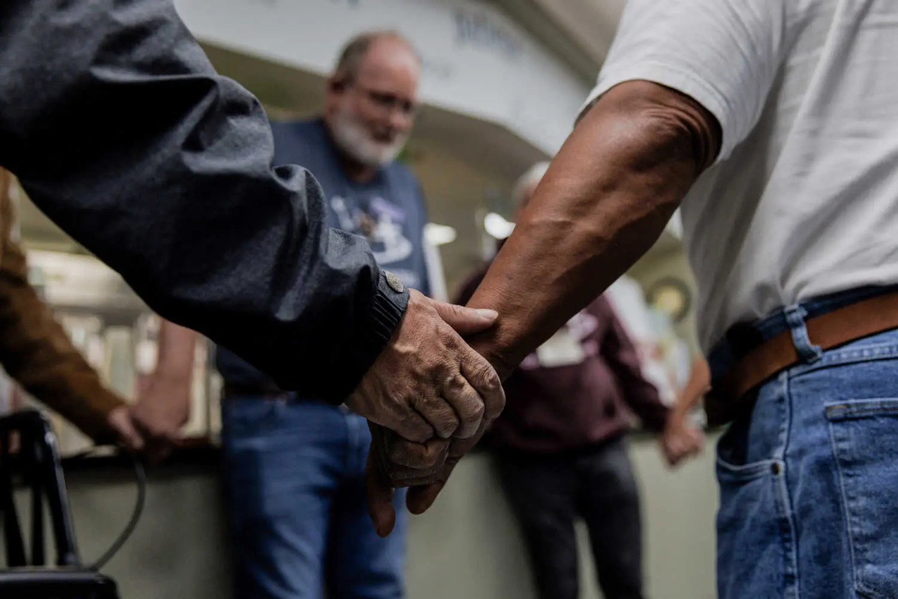

---

Voting is a fundamental right and a cornerstone of democracy, yet young people often face significant barriers to participating in the electoral process. Low youth voter turnout is a persistent issue that undermines the representativeness of our political system. This article examines the challenges young voters face and explores potential solutions to increase youth engagement in elections.

## Barriers to Youth Voting

Several factors contribute to low youth voter turnout, including:

- **Registration Requirements:** Complex and varying registration procedures can create obstacles for young voters, particularly those who are first-time voters or frequently change addresses.
- **Accessibility Issues:** Lack of convenient polling locations, limited voting hours, and inaccessible voting technologies can hinder participation.
- **Lack of Information:** Many young people lack information about voter registration deadlines, polling locations, and candidate platforms.
- **Disillusionment and Apathy:** Some young people feel that their votes don't matter or that politicians don't represent their interests, leading to disengagement.

### Registration Challenges

Registering to vote can be a cumbersome process, especially for young people who may be unfamiliar with the requirements or deadlines. In some states, strict voter ID laws and proof of residency requirements can disproportionately impact young voters who may not have readily available documentation.

### Accessibility Issues

Access to polling locations is another significant barrier for young voters, particularly for college students who may be studying away from home or living on campus. Limited voting hours and transportation difficulties can further impede participation.

## Strategies to Increase Youth Turnout

### Simplifying Registration and Voting Processes

To increase youth voter turnout, it is essential to simplify registration and voting processes. Measures such as automatic voter registration, online registration, and same-day registration can make it easier for young people to participate in elections. Expanding early voting options and ensuring accessible polling locations can also improve turnout.

> "Making voting more accessible and convenient is key to engaging young voters," argues James Morton, a political analyst. "We need to remove unnecessary barriers and make it easier for young people to exercise their right to vote."

### Educating and Engaging Young Voters

Providing young people with information about the importance of voting and the electoral process is crucial for increasing turnout. Educational initiatives, such as voter registration drives, candidate forums, and nonpartisan voter guides, can help young people make informed decisions.

### Addressing Disillusionment and Apathy

To address disillusionment and apathy among young voters, it is important to demonstrate that their votes matter and that politicians are responsive to their concerns. Encouraging candidates to engage with young people and address issues relevant to their lives can help foster a sense of political efficacy.

## Different Perspectives

### The Role of Civic Education

Some argue that strengthening civic education in schools can foster a greater sense of civic responsibility among young people and increase their likelihood of voting. By teaching students about the importance of voting and the mechanics of the electoral process, schools can help cultivate a culture of democratic participation.

### The Impact of Political Polarization

Others contend that political polarization and negative campaigning can deter young people from engaging in politics. When political discourse is characterized by divisiveness and negativity, young people may become disillusioned with the political process and less likely to vote. Promoting civility and respectful dialogue can help create a more welcoming environment for young voters.

## Conclusion

Increasing youth voter turnout is essential for ensuring a vibrant and representative democracy. By addressing the barriers to youth voting, simplifying registration and voting processes, and fostering a culture of civic engagement, we can empower young people to participate in elections and make their voices heard. It is imperative that policymakers, educators, and community leaders work together to break down barriers and ensure that all young people have the opportunity to exercise their fundamental right to vote.

---