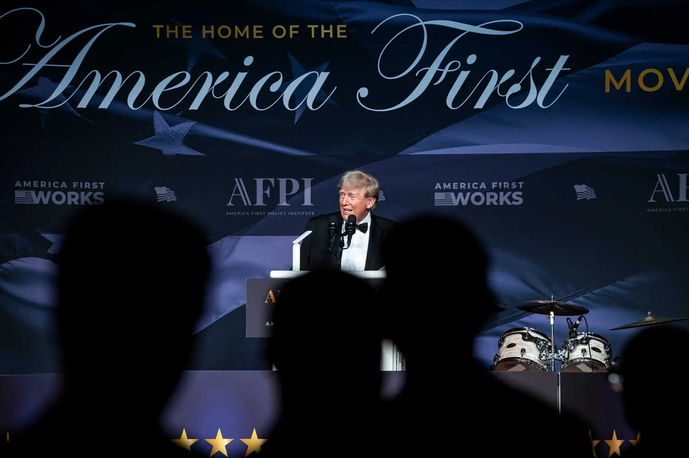

# Second Article Example

This article demonstrates another example of our content structure. 

## Introduction

We can include various types of content and formatting in our articles.

## Main Content

This section contains the main content of our article. We can include:

1. Numbered lists
2. Images
3. Formatted text

## Conclusion

Wrapping up the article with some final thoughts and conclusions.