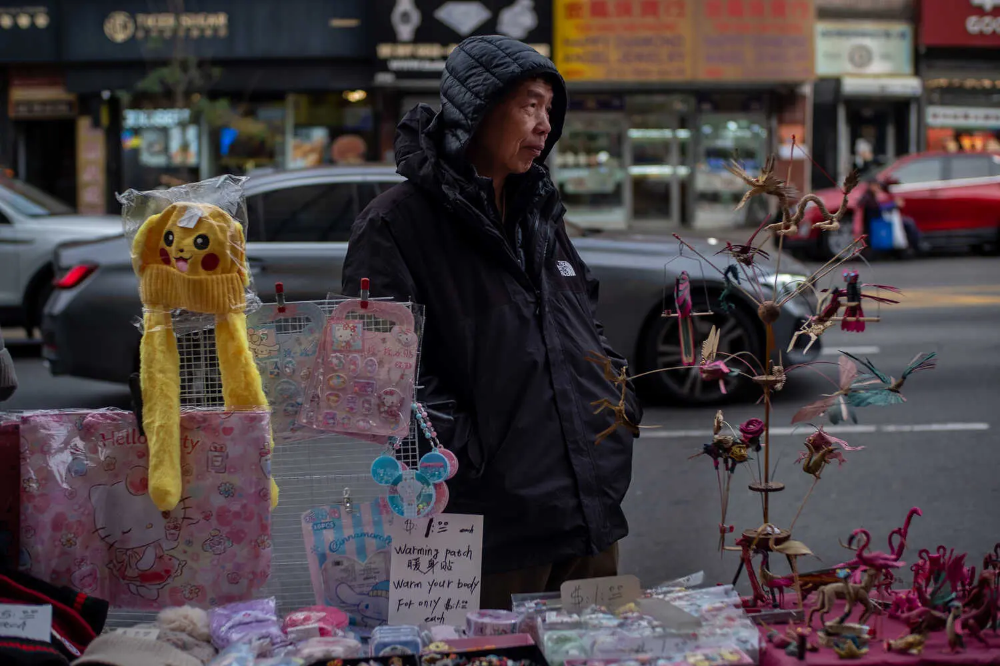
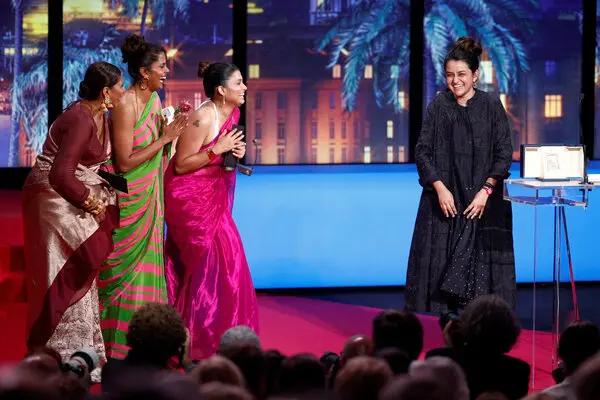

---

A new wave of youth activism is sweeping the globe, with young people taking to the streets and online platforms to demand change on a range of issues, from climate change and gun violence to social justice and economic inequality. This surge in youth-led activism reflects a growing awareness of the challenges facing our world and a determination to shape a better future. This article explores the factors driving this rise in youth activism and its impact on policy and society.

## A Generation Finding Its Voice

Young people today are inheriting a world grappling with complex problems. They are witnessing firsthand the impacts of climate change, experiencing the consequences of social and economic injustices, and feeling the weight of political polarization. This has fueled a sense of urgency and a desire to create a more just and sustainable world.

### Digital Empowerment

Social media and digital platforms have played a crucial role in amplifying youth voices and mobilizing movements. The ability to connect with like-minded individuals across geographical boundaries, share information rapidly, and organize collective action online has empowered young activists to reach a wider audience and exert greater influence.

> "Social media has become our megaphone," says 17-year-old climate activist Greta Thunberg. "It allows us to connect with millions of people around the world and build a global movement for change."

## From Marches to Movements: Key Examples

### Climate Action

Inspired by Greta Thunberg, millions of young people worldwide have participated in climate strikes and protests, demanding urgent action to address the climate crisis. Youth-led organizations like Fridays for Future and the Sunrise Movement have played a key role in raising awareness and advocating for policy changes to reduce greenhouse gas emissions and transition to a clean energy economy.

### Gun Violence Prevention

Following school shootings, student-led movements like March for Our Lives have emerged, demanding stricter gun control measures and an end to gun violence. These young activists have organized protests, registered voters, and lobbied lawmakers, demonstrating their commitment to creating safer communities.

### Social Justice Movements

Young people have been at the forefront of social justice movements, advocating for racial equality, LGBTQ+ rights, and gender equality. The Black Lives Matter movement, fueled by youth activism, has brought renewed attention to systemic racism and police brutality, sparking protests and calls for police reform.

## The Impact of Youth Activism

### Policy Changes

Youth activism has led to tangible policy changes in various areas. From climate action plans and gun control legislation to increased funding for education and mental health services, young activists have successfully advocated for policies that address their concerns and shape a better future.

### Shifting Social Norms

Beyond policy changes, youth activism has also played a role in shifting social norms and attitudes. By raising awareness about critical issues and challenging established power structures, young activists have helped create a more inclusive and equitable society.

## Challenges and the Path Forward

Youth activism faces challenges such as maintaining momentum, navigating political divisions, and combating misinformation. However, the passion, creativity, and resilience of young activists offer hope for a brighter future. By continuing to organize, mobilize, and advocate for change, young people can play a crucial role in shaping a more just and sustainable world for generations to come.

---